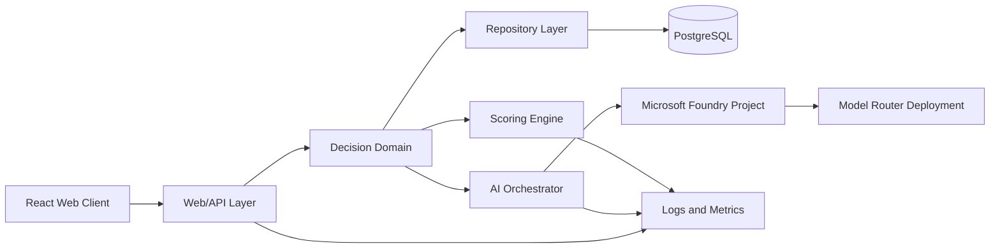
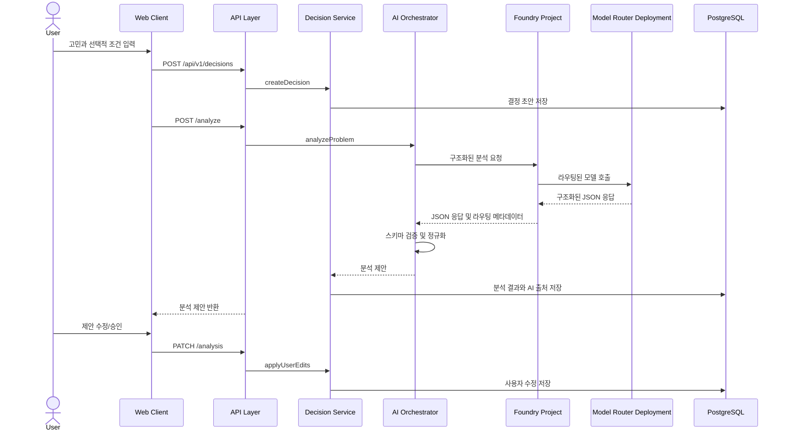
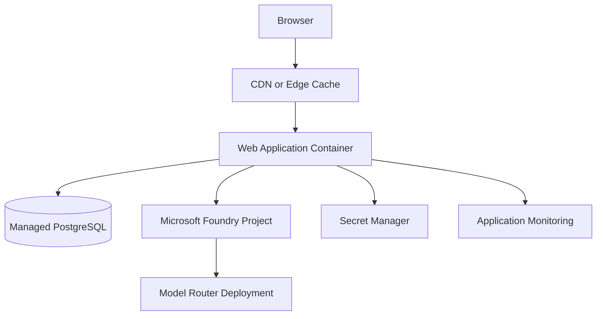

# Decision Lab 시스템 아키텍처

## 1. 문서 개요

### 1.1 목적

이 문서는 [IDEATION.md](IDEATION.md)의 제품 방향과 [PRD.md](PRD.md)의 MVP 요구사항을 실제 시스템 구조로 연결한다. 초기 제품은 빠른 검증과 일관된 의사결정 계산을 우선하며, AI 기능과 결정 도메인 로직을 분리해 이후 확장과 교체가 가능하도록 설계한다.

### 1.2 설계 목표

- 사용자의 결정 과정을 하나의 명확한 도메인 흐름으로 관리한다.
- AI는 제안과 설명을 담당하고, 점수 계산과 상태 전이는 서버의 결정론적 코드가 담당한다.
- 사용자가 수정한 값은 AI 재분석으로 덮어쓰지 않는다.
- What-if 결과는 저장된 결정 상태와 분리된 임시 계산으로 처리한다.
- MVP 운영 복잡도를 낮추되, 인증/저장소/AI 제공자를 교체할 수 있는 경계를 둔다.

## 2. 아키텍처 결정 요약

| 영역 | 결정 | 이유 |
| --- | --- | --- |
| 애플리케이션 구조 | 모듈형 모놀리스 | 초기 기능 간 호출이 많고 배포 단위를 단순하게 유지하기 위함 |
| 웹 계층 | 서버 렌더링 중심의 React 웹앱 | 초기 로딩, 접근성, 폼 중심 흐름에 유리 |
| API | 버전이 있는 REST API | 웹 클라이언트와 도메인 테스트를 분리하고 향후 모바일 클라이언트에 대비 |
| 영속성 | 관계형 데이터베이스 | 결정, 선택지, 기준, 평가, 스냅샷의 무결성과 조회가 중요 |
| AI 호출 | 서버 전용 Microsoft Foundry Model Router 어댑터 | Azure 구독 내 중앙 라우팅, 모델 교체 독립성, API 키 비노출 |
| 점수 계산 | 서버 도메인 서비스 + 클라이언트 미리보기 | 저장/확정 결과의 신뢰성을 보장하고 조절 중에는 즉시 피드백 제공 |
| 비동기 처리 | MVP에서는 요청-응답, 지연 증가 시 작업 큐로 분리 | 초기 구현을 단순하게 유지하되 확장 경로 확보 |

## 3. 논리 아키텍처

### 3.1 Web/API 계층

책임:

- HTTP 요청 검증과 인증 컨텍스트 확인
- DTO와 도메인 객체의 변환
- 응답 상태 코드와 오류 형식 통일
- 스트리밍이 필요한 AI 진행 상태의 전달
- 도메인 내부 구현을 외부에 노출하지 않기

Web/API 계층은 점수 계산이나 상태 전이를 직접 구현하지 않는다. 모든 변경은 Decision 도메인 서비스의 명령을 통해 수행한다.

### 3.2 Decision 도메인

핵심 aggregate는 `Decision`이다. 선택지, 판단 기준, 평가, 현재 상태는 하나의 결정에 속하며, 변경 가능 여부는 결정 상태에 따라 제어한다.

주요 책임:

- 고민 생성과 분석 상태 관리
- 선택지 및 판단 기준 추가/수정/삭제
- AI 제안 승인과 사용자 수정 반영
- 평가와 중요도 변경
- 종합 점수, 순위, 안정성 계산 요청
- What-if 시뮬레이션
- 최종 결정 확정과 스냅샷 저장
- 회고 기록 연결

### 3.3 AI Orchestrator

AI 기능을 다음 단계로 분리한다.

1. `analyzeProblem`: 고민 요약, 선택지 초안, 기준 초안, 추가 질문
2. `suggestOptions`: 선택지의 설명, 장점, 단점 보완
3. `suggestCriteria`: 기준 이름, 설명, 추천 이유, 평가 방향
4. `evaluateOptions`: 기준별 점수와 근거
5. `explainDecision`: 결과의 주요 기여 요인, 약점, 상충 요소, 확인 질문

AI Orchestrator는 Microsoft Foundry Model Router의 논리적 배포를 호출하고, 모델 응답을 스키마로 검증한 뒤 도메인 명령으로 변환한다. 애플리케이션은 개별 기반 모델을 직접 선택하지 않는다. 모델이 반환한 종합 점수나 안정성은 신뢰하지 않고 Scoring Engine에서 다시 계산한다.

#### Foundry Model Router 경계

- 애플리케이션은 Foundry 프로젝트 엔드포인트와 Router 배포 이름만 사용한다.
- Router가 내부적으로 선택하는 기반 모델, 버전, 라우팅 정책은 애플리케이션 코드와 분리한다.
- Router 호출은 Entra ID 기반 자격 증명과 Managed Identity를 우선 사용하며, API 키는 개발용 예외로만 취급한다.
- 응답에는 구조화된 출력 계약을 요구하고, 호출 직후 런타임 스키마 검증을 수행한다.
- 실제 선택 모델, 라우팅 정책 버전, 지연 시간, 토큰 사용량은 비민감 운영 메타데이터로 추적하되 사용자 고민 원문은 기록하지 않는다.

### 3.4 Scoring Engine

순수 함수로 구현하며 데이터베이스, AI, HTTP에 의존하지 않는다.

- 가중 평균 종합 점수 계산
- 점수 내림차순 순위 계산
- 1위와 2위의 점수 차이 계산
- 안정성 수준 판정
- What-if 입력에 대한 임시 결과 계산
- 순위 역전 전후의 영향을 준 기준 탐지

동일 입력은 항상 동일 결과를 반환해야 하며, 부동소수점 결과는 API/DB 응답에서 소수 둘째 자리까지 반올림한다. 내부 비교에서는 반올림 전 값을 사용한다.

### 3.5 Repository 계층

도메인 서비스가 특정 ORM이나 데이터베이스에 직접 의존하지 않도록 repository 인터페이스를 제공한다.

- `DecisionRepository`
- `OptionRepository`
- `CriterionRepository`
- `EvaluationRepository`
- `DecisionSnapshotRepository`
- `RetrospectiveRepository`

MVP 구현체는 PostgreSQL 어댑터를 사용한다. 저장소 변경은 aggregate 단위 트랜잭션으로 처리한다.

## 4. 주요 데이터 흐름

### 4.1 고민 분석 흐름

### 4.2 점수 및 What-if 흐름

1. UI가 중요도 또는 평가 점수 변경을 입력한다.
2. 클라이언트는 즉시 Scoring Engine과 동일한 계산 규칙으로 미리보기를 표시한다.
3. 서버는 저장 또는 확정 요청에서 입력을 다시 검증하고 Scoring Engine을 실행한다.
4. 서버가 반환한 결과를 기준값으로 사용한다.
5. What-if는 `baseSnapshot`을 변경하지 않고 임시 가중치로 계산한다.

### 4.3 결정 확정 흐름

1. 서버는 결정이 `comparing` 상태인지 확인한다.
2. 선택지가 2개 이상이고 기준이 1개 이상인지 확인한다.
3. 모든 필수 평가가 존재하는지 확인한다.
4. 최신 기준과 평가로 점수/순위/안정성을 재계산한다.
5. `DecisionSnapshot`을 생성한다.
6. 선택된 선택지와 `decided_at`을 기록하고 상태를 `decided`로 변경한다.
7. 확정 당시 설정은 이후 수정으로 변하지 않도록 스냅샷으로 보존한다.

## 5. 배포 아키텍처

### 5.1 MVP 배포 단위

- 하나의 웹 애플리케이션 컨테이너
- 하나의 관리형 PostgreSQL 인스턴스
- Microsoft Foundry 프로젝트와 Model Router 배포
- Entra ID 인증 및 애플리케이션 Managed Identity
- 개발 환경용 Secret Manager 또는 환경 변수
- 애플리케이션 로그와 오류 모니터링

웹앱과 API를 별도 서비스로 나누지 않는다. AI 호출량이나 작업 시간이 증가해 요청 시간이 제품 경험을 해치면 AI Worker와 작업 큐를 별도 배포 단위로 분리한다.

### 5.2 환경

- `local`: 로컬 PostgreSQL 또는 개발용 컨테이너, Foundry Router를 모사하는 테스트 AI 어댑터
- `staging`: 운영과 동일한 스키마, 별도 Foundry 프로젝트 또는 Router 배포, 제한된 AI 사용량
- `production`: 관리형 DB, 운영 Foundry 프로젝트/Router 배포, Managed Identity, 모니터링, 백업

## 6. 보안 및 개인정보 경계

- Foundry 프로젝트 엔드포인트와 Router 배포 호출은 서버에서만 수행하며 브라우저에 자격 증명을 전달하지 않는다.
- 운영에서는 Managed Identity와 Entra ID를 사용하고 장기 수명 AI API 키를 저장하지 않는다.
- 모든 결정 조회/수정은 사용자 소유권 검사를 거친다.
- 입력 길이, 선택지 수, 기준 수, 메모 크기를 서버에서 제한한다.
- HTML을 허용하지 않고 텍스트를 기본값으로 저장해 XSS를 줄인다.
- 로그에 고민 원문, 민감 정보, AI API 키를 기록하지 않는다.
- 데이터베이스와 외부 API 통신은 전송 구간 암호화를 사용한다.
- 사용자가 삭제한 결정과 회고는 애플리케이션 조회에서 즉시 제외하고, 백업 보존 정책은 별도로 고지한다.
- 의료/법률/투자/안전 관련 입력은 AI 결과를 참고용으로 표시하고 전문 도움을 권고한다.

## 7. 장애 및 복구 전략

| 장애 | 사용자 동작 | 시스템 동작 |
| --- | --- | --- |
| AI 시간 초과 | 재시도 또는 수동 입력 선택 | 요청을 실패로 표시하고 초안은 보존 |
| AI 구조 검증 실패 | 다시 분석 | 원본 응답은 사용자 화면에 노출하지 않고 오류 기록 |
| Foundry/Router 오류 | 수동 비교로 진행 | AI 의존 단계만 차단하고 도메인 기능은 유지 |
| DB 일시 오류 | 저장 재시도 | 트랜잭션 롤백, 중복 요청 방지 키 사용 |
| 클라이언트 연결 끊김 | 페이지 재접속 | 저장된 초안과 마지막 스냅샷 복원 |
| 잘못된 점수 입력 | 오류 메시지 확인 | 서버 범위 검증으로 저장 거부 |

## 8. 확장 경로

- Foundry Router 정책 변경: Router 배포 설정만 변경하고 `AiProvider` 계약은 유지
- AI 제공자 추가: `AiProvider` 인터페이스 구현체 추가
- 저장소 추가: repository 인터페이스 구현체 추가
- 모바일 클라이언트: 동일 REST API 사용
- 긴 AI 작업: `AnalysisJob`과 queue/worker 도입
- 외부 데이터: 출처와 수집 시점을 가진 `Evidence` 도메인 추가
- 개인화: 회고 데이터와 동의 관리가 포함된 별도 분석 파이프라인 추가

## 9. 아키텍처 리스크

- AI가 평가 점수를 생성하면 근거가 약한 숫자가 정밀한 판단처럼 보일 수 있다. 따라서 점수 출처와 불확실성을 표시하고 사용자 수정 권한을 제공한다.
- 기준 수가 많아지면 가중 평균이 사용자의 실제 판단을 과도하게 단순화할 수 있다. MVP에서는 기준 개수를 안내하고, 결과에 기여도를 함께 표시한다.
- 로그인 없이 저장하면 기록 복구가 어렵고, 로그인부터 시작하면 첫 경험이 무거워진다. MVP 착수 전에 익명 저장과 계정 저장 중 하나를 결정해야 한다.
- Router가 선택한 기반 모델이 바뀌면 응답 품질과 비용이 달라질 수 있다. 구조화 응답 검증, 고정 평가 세트, 라우팅 메타데이터 모니터링으로 회귀를 감지한다.
- 외부 최신 데이터가 없으면 구매 의사결정의 품질이 제한된다. MVP에서는 외부 데이터 자동 수집을 약속하지 않고 사용자 입력과 출처 확인을 우선한다.